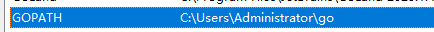
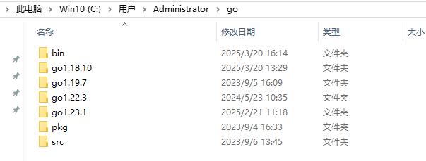
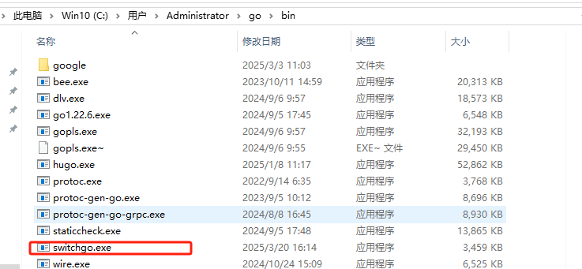

# switchgo

用来快速切换 go 版本的小工具

1.首先得得要先配置有 GOPATH，然后再将不同版本的 go 包，保存在 GOPATH 目录下，命名格式为 goXXX
比如，我的 GOPATH 是 C:\Users\Administrator\go


2.当前 GOPATH 安装的 go 版本


3,下载 switchgo 将它放在 GOPATH 的 bin 目录下，并且需要在 PATH 配置下，使其 bin 目录下的可执行文件，可以全局执行


4.比如要将 go 版本切换到 1.18.10，运行如下

```sh
switchgo to -v 1.18.10
```

如果没有配置有 GOPATH，那么可以使用

```sh
switch to -v 1.18.10 -p C:\\Users\\Administrator\\go
```
